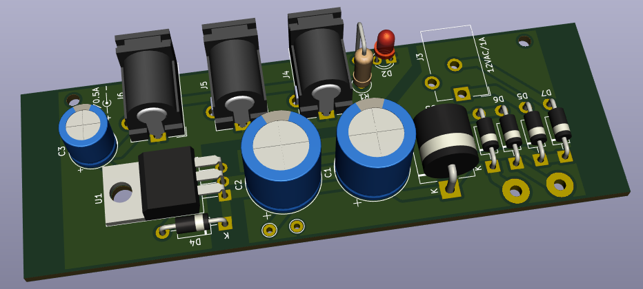

# Pedal Power

This is a power supply for guitar pedals. It's a basic AC-DC converter that I built to get
comfortable with rectifying mains AC. Unlike most AC adapters, it's a linear power supply, not
switching. The reason I built it this way is because I wanted low noise since this is for an
audio application. It's also much simpler than a switching supply. The tradeoff is that it's
bigger, less efficient, and hotter, but that's an acceptable trade for a pedalboard. I used
exclusively through-hole parts to make it easier to build (and to repair when it eventually
breaks).

**N.B.:** For reasons lost to the sands of time, guitar pedal power jacks are wired **center
negative**. This is not how the vast majority of other DC receptacles are wired. Keep that in
mind if you decide to make this and want to plug it into something normal.

## Specifications

- Input: 115/120V, 50/60Hz AC
- Output: 9V DC, center negative, up to 500mA total across three jacks
- Reassuring power light

There's room on the board for a 12V/1A AC output&mdash;I had an ancient tube compressor that needed
this&mdash;but I didn't end up populating that in the actual build.

## Enclosure

I enclosed the PCB and transformer in a [Hammond 1455KHD1201BK](https://www.hammfg.com/electronics/small-case/extruded/1455nhd).
The case is attached to the ground terminal on the power entry module (see "Other Parts" below).

For heat dissipation, the regulator (U1) is attached to the enclosure with a strip of aluminum I
cut from a soda can and some thermally conductive double-sided tape.

## Other Parts

A couple parts aren't specified in the schematic:

- Transformer: Hammond 166GD12
- Power entry module: Schaffner FN285-2-06
